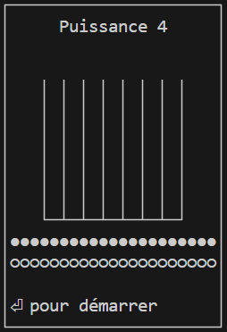
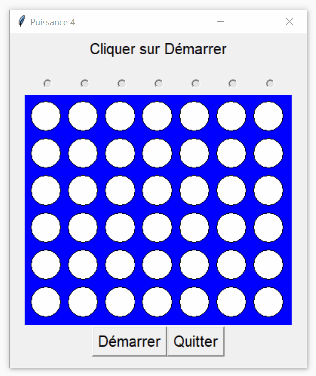

# Puissance 4
Petit jeu de puissance 4 pour l'enseignement du developpement de projets collaboratif en classe de terminale (spécialité NSI)
[Page de l'activité sur info.blaisepascal.fr](https://info.blaisepascal.fr/prj-puissance-4/)

## Modélisation
Voir les diagrammes draw.io

## Rendu final
### mode texte

### mode tkinter

